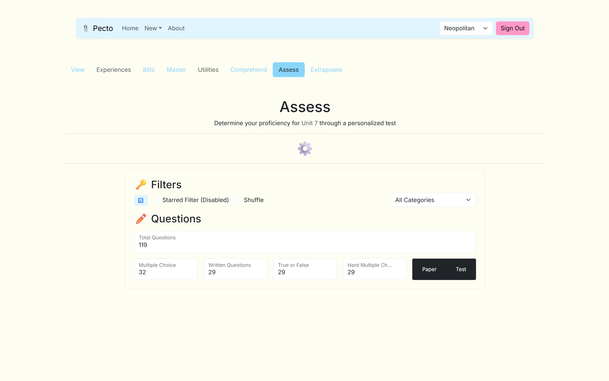
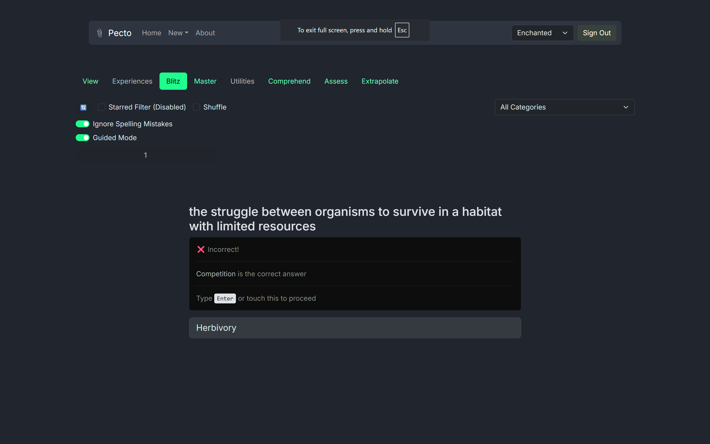
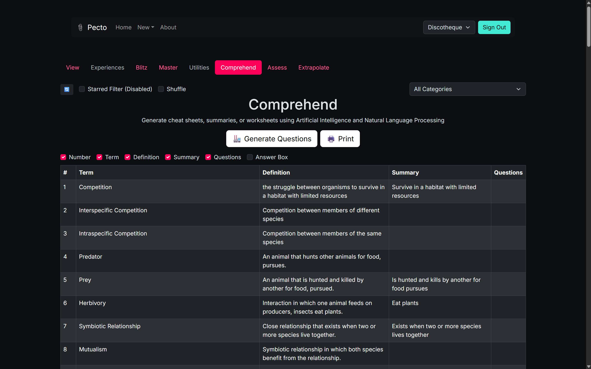
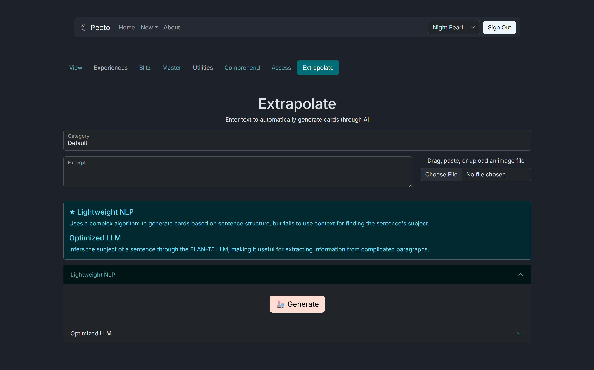
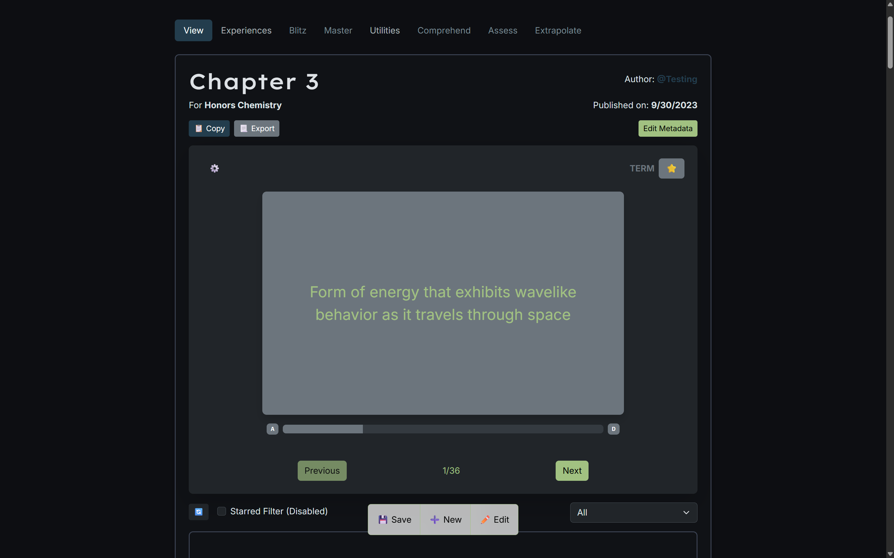
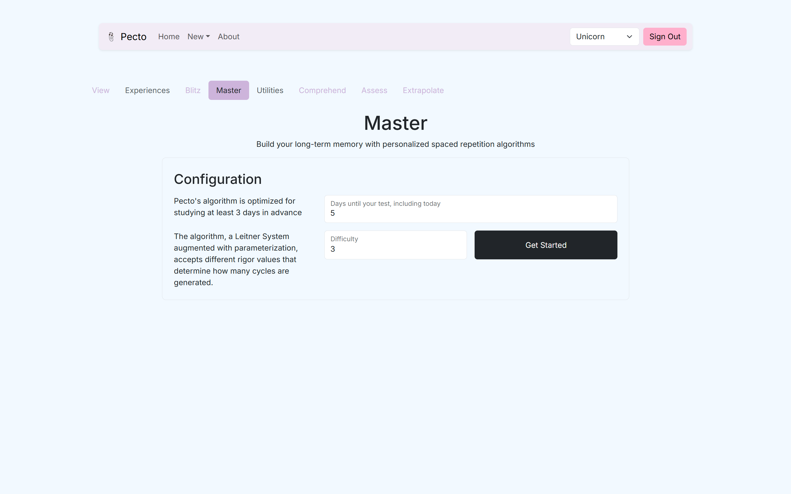
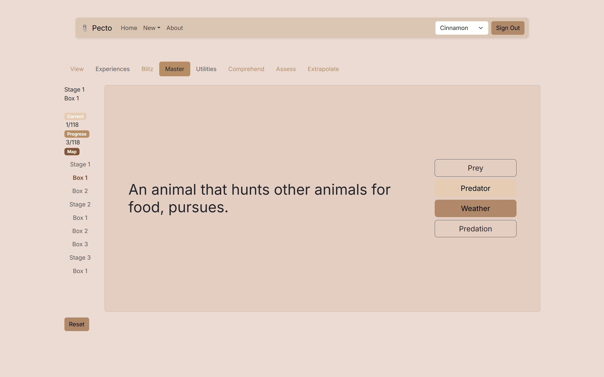

# Pecto

Written in 2023 as an algorithmic memorization app that uses flashcards as input

Over 8000 lines of code in modern React (JSX) and CSS (SASS)
* Implemented multiple retention algorithms and NLP features
* Used CSR rather than SSR to serve content, enabling more interactive experiences; minimized running costs
to domain renewal and static file hosting rather than utilizing server resources
* All AI features were carefully selected to run quickly and locally
* Import content through a text file with custom separators (Quizlet, etc.)
* Can also use OCR (Tesseract) to read a picture as text and then use either NLP or a small local LLM to find a subject and term ("Extrapolate" Section)
* State management through Zustand
* Authentication and DB through Firebase
* Full offline functionality through Dexie
* Framer Motion for smooth animation
* Remirror for content entry everywhere
* Bootstrap modified to support separate themes (which are also dynamically loaded in chunks)
* Full PWA functionality through VitePWA

Icons and backgrounds designed in Figma.

## Screenshots

